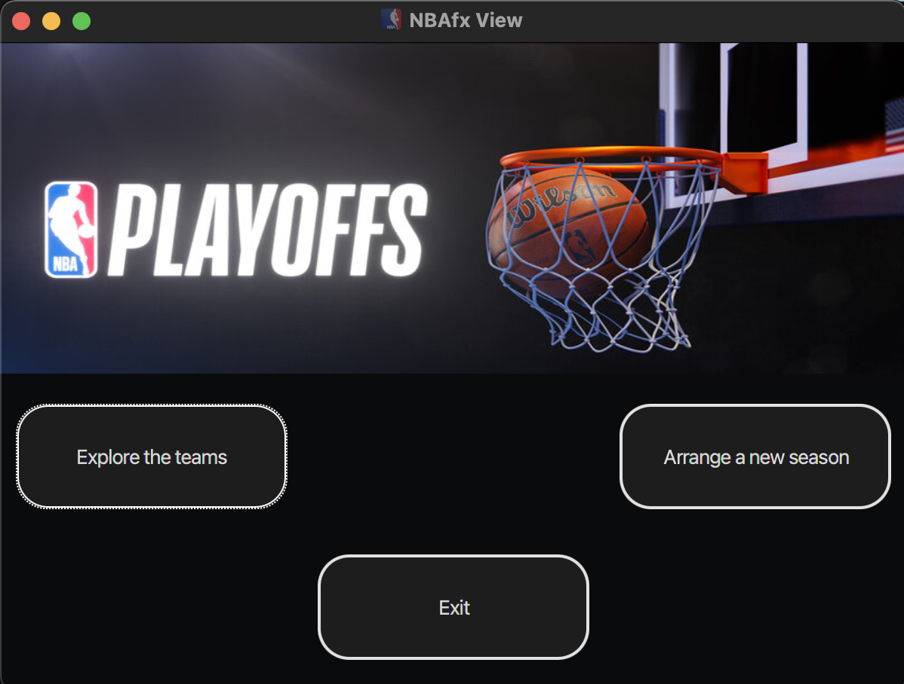

<div align="center">
  
</div>

# UTS OOP Assignment 2: Java NBA Game System (HD Grade)

This project is a GUI-based NBA team and season management system built using JavaFX, following the MVC pattern. It enables users to manage teams, simulate seasons, and view results dynamically.

By adhering to the [assignment’s specifications](AssignmentSpecifications.pdf) and ensuring accurate game logic, I earned full marks (25/25).

## Key Features

- **Team & Player Management**: Add, update, and remove teams and players through a clean interface.
- **Season Simulation**: Organize teams into rounds, simulate games, and track season progress.
- **Interactive Views**: Multiple windows (team management, season rounds, game results) with real-time updates.

## Demo Video

A full demonstration of the app can be [found here](https://drive.google.com/file/d/1ePj5xPwfbDFfER0zk-E37AlPZ9skpDqR/view?usp=sharing)

## Running the App

Run the app by executing the JAR file:
```bash
java -jar NBAfx.jar

